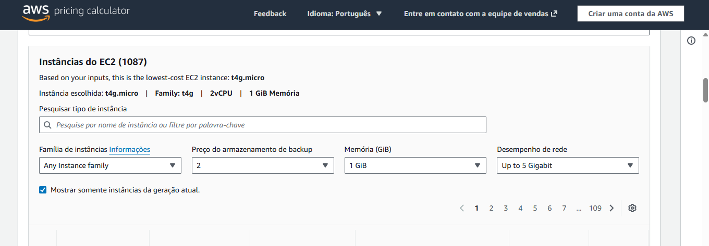
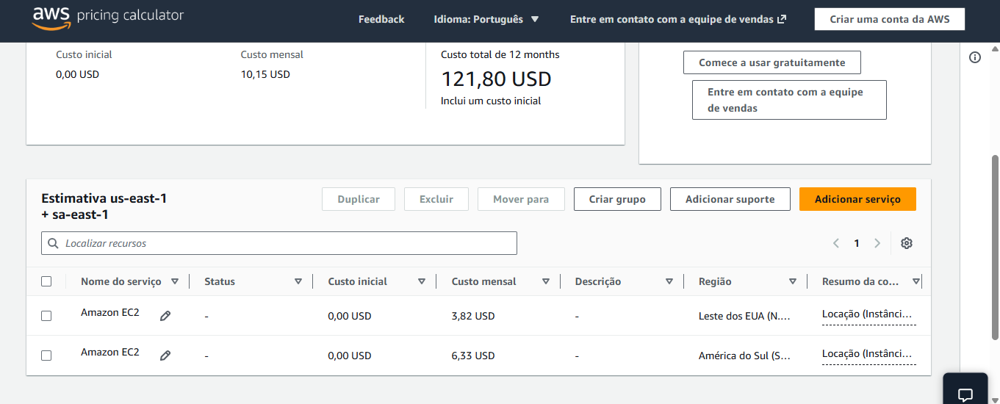

# Fase 5 - Atividade de Machine Learning - Entrega 1

## Propósito
A primeira atividade explora o dataset "Crop_Yield", buscando prever a produção agrícola (Yield) por meio de condições climáticas e tipos distintos de cultura

## Etapas
- Análise exploratória dos dados
- Tratamento de valores ausentes
- Criação de pipelines com ColumnTransformer
- Construção de modelos de Machine Learning de regressão (RandomForest, Linear, Ridge, Gradient Boosting e Decision Tree)

## Notebook
Para maiores informações, segue o link do notebook:
[RobertoFerreira_rm561131_pbl_fase5.ipynb](./Notebook/RobertoFerreira_rm561131_pbl_fase5.ipynb)

## Link do vídeo da entrega 1
Aqui, o link para o vídeo desta entrega:
https://youtu.be/GLxti6zcO2s  

  
# Fase 5 - Atividade de Machine Learning - Entrega 2

## Propósito
A segunda atividade consiste na simulação do uso da estrutura da AWS, com armazenamento de dados nos servidores us-east-1 (Virgínia do Norte) e sa-east-1 (São Paulo)

## Explicações
O serviço escolhido foi o EC2 T4g, graças ao seu baixo custo e alta flexibilidade de instancias. O armazenamento em HDD Cold segue a linha de redução de custos e desempenho favorável. 

## Cenário de restrições legais
Em um cenário de restrições legais de armazenamento, o servidor sa-east-1 desponta como uma escolha interessante. Sua localização garante um armazenamento seguro dos dados, além de baixa latência de processamento. 

## Link do vídeo da entrega 2
Aqui, o link do vídeo da entrega 2:
https://youtu.be/G6qgzZrh-30

## Imagens da calculadora AWS
Seguem imagens referentes a escolha pela T4g e aos preços dos serviços, onde vemos que os preços do servidor estadunidense são inferiores ao preço do servidor local.

